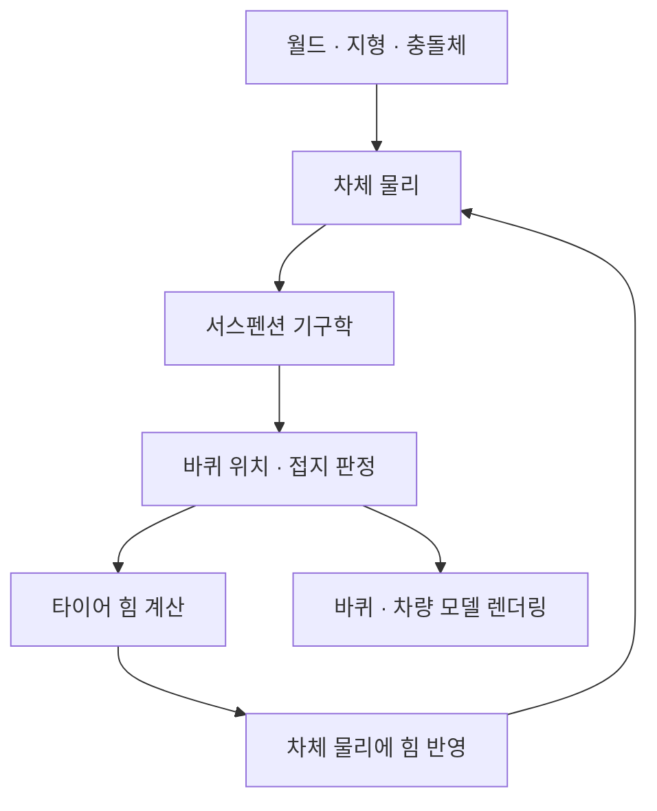
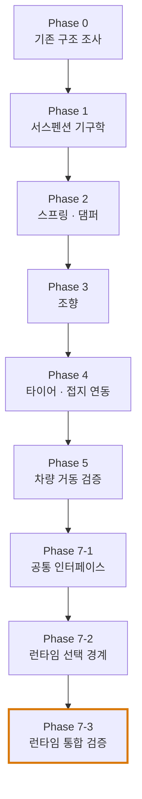
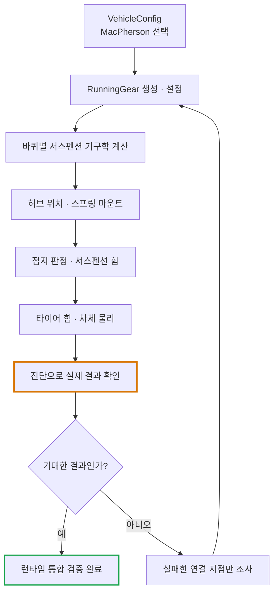
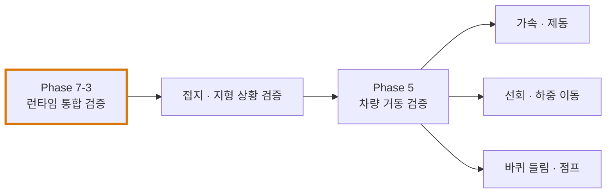

# DriveTest 진행 상황 시각 안내

> 목적: 프로젝트의 전체 흐름과 현재 작업 위치를 빠르게 파악하기 위한 문서.
> 서스펜션의 상세 설계와 구현 규약은 [WheelSuspensionArchitecture.md](./WheelSuspensionArchitecture.md)를 기준으로 한다.
>
> 이 문서는 진행 상황을 설명하기 위한 시각적 안내서다. 코드와 진단 결과가 바뀌면 상태 표기도 실제 증거에 맞춰 갱신한다.

## 1. 차량 물리 전체 흐름

차량이 움직이는 데 필요한 주요 단계와 피드백 루프다.

핵심은 각 요소가 존재하는 것만으로 충분하지 않다는 점이다. 실제 런타임 경로에서 올바른 순서로 연결되고, 계산 결과가 다음 단계에 전달되어야 한다.

## 2. 서스펜션 작업 로드맵

### 현재 위치

현재 목표는 **런타임 통합 검증**이다. 공통 서스펜션 인터페이스와 구성 선택 구조가 코드에 존재하고, 사용자가 실행한 `PhysicsDiagnostics`, `VehicleDiagnostics`, `MacPhersonDiagnostics` 세 테스트는 모두 통과했다.

테스트 통과는 중요한 진전이지만, 그것만으로 게임 실행 중의 전체 차량 거동이 정상임을 증명하지는 않는다. 런타임 경로와 실제 주행 검증은 별도로 확인해야 한다.

## 3. 런타임 통합 검증 흐름

선택한 서스펜션 종류가 실제 차량 물리 계산으로 이어지는지 확인한다.

이번 검증에서는 서스펜션 기구학이나 타이어 힘을 무작정 바꾸지 않는다. 먼저 설정부터 바퀴별 기구학, 접지, 힘 적용까지의 데이터 흐름을 추적하고, 문제가 재현되는 연결 지점만 수정한다.

## 4. 런타임 검증 이후의 순서

권장 순서는 다음과 같다.

1. 런타임에서 선택된 서스펜션이 실제로 사용되는지 확인한다.
2. 평지, 경사면, 지형 경계, 일부 바퀴가 공중에 뜨는 상황에서 접지 동작을 검증한다.
3. 가속과 제동을 확인한다.
4. 선회와 좌우 하중 이동을 확인한다.
5. 바퀴 들림과 점프 등 더 복잡한 거동을 검증한다.

## 상태를 읽는 기준

- **구현됨**: 관련 코드 경로가 존재한다.
- **진단 통과**: 해당 진단이 실행되어 통과했다.
- **런타임 검증 완료**: 실제 런타임 동작을 확인할 수 있는 증거가 있다.
- **주행 검증 완료**: 실제 차량 거동에 대한 요구 조건을 확인했다.

이 상태들은 서로 같은 의미가 아니다. 코드를 추가했다는 이유만으로 런타임이나 주행 검증까지 완료로 표시하지 않는다.
