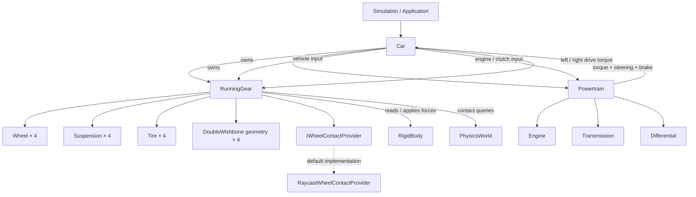
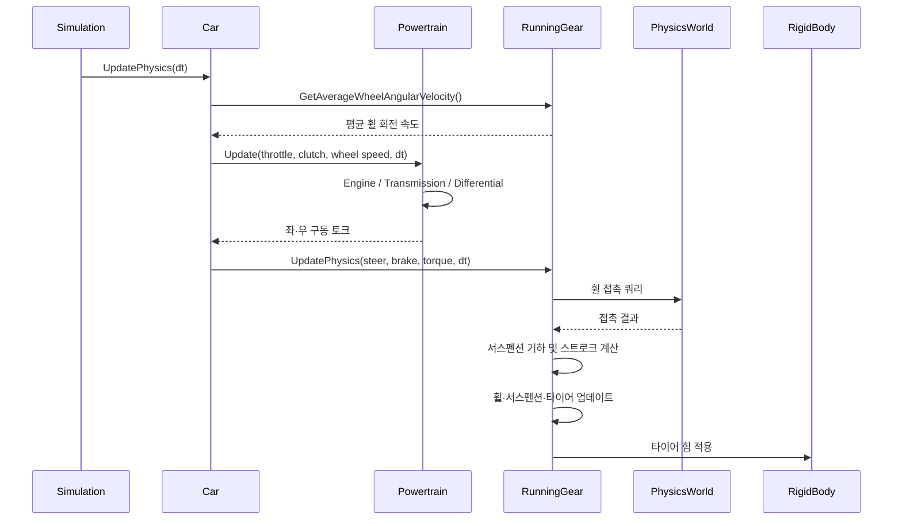

# DriveTest 차량 아키텍처 개편안

## 1. 목적

현재 `Car`는 차량을 대표하는 상위 클래스이지만, 차량 전체를 조율하는 책임을 넘어 서스펜션 기하 생성·스트로크 탐색·조향 기하 계산·접촉 쿼리·타이어 힘 적용·파워트레인 업데이트·에너지 및 주행 로그까지 직접 처리한다.

이 구조에서는 기능을 수정할 때 `Car.cpp`의 서로 다른 물리 책임이 한꺼번에 영향을 받을 수 있고, 서스펜션 구현을 교체하거나 파워트레인을 확장할 때도 `Car`가 구체 구현을 알아야 한다.

목표는 디렉터리 이름만 바꾸는 것이 아니다. **기능별 책임을 분리하고, `Car`를 차량 구성과 업데이트 흐름을 조율하는 상위 객체로 축소한다.** 기존 물리 동작을 유지하는 것이 우선이며, 대규모 물리 모델 변경은 이번 리팩터링에 섞지 않는다.

## 2. 용어와 디렉터리 제안

이 문서에서는 프로젝트 내 사용자의 분류를 따라 휠·서스펜션·타이어 묶음을 `RunningGear`(주행 하체), 엔진·트랜스미션·디퍼렌셜 묶음을 `Powertrain`(파워트레인)으로 구분한다. 일반적인 자동차 공학 용어에서 powertrain/drivetrain의 범위는 다르게 쓰일 수 있으므로, 코드에서는 이름보다 책임 경계를 일관되게 유지한다.

목표 디렉터리 구조:

```text
Vehicle/
├── Car.h
├── Car.cpp
├── VehicleConfig.h
├── VehicleConfig.cpp
├── VehicleConfigWatcher.h
├── VehicleConfigWatcher.cpp
├── VehicleCoordinates.h
│
├── RunningGear/
│   ├── RunningGear.h
│   ├── RunningGear.cpp
│   ├── Wheel.h
│   ├── Wheel.cpp
│   ├── Suspension.h
│   ├── Suspension.cpp
│   ├── Tire.h
│   ├── Tire.cpp
│   ├── ISuspensionGeometry.h
│   ├── DoubleWishbone.h
│   ├── DoubleWishbone.cpp
│   ├── MacPherson.h
│   ├── MacPherson.cpp
│   ├── IWheelContactProvider.h
│   └── RaycastWheelContactProvider.cpp
│
└── Powertrain/
    ├── Powertrain.h
    ├── Powertrain.cpp
    ├── Engine.h
    ├── Engine.cpp
    ├── Transmission.h
    ├── Transmission.cpp
    ├── Differential.h
    └── Differential.cpp
```

위 구조는 목표안이다. 파일 이동은 한 번에 전부 하지 않는다. 현재 `Powertrain.h/.cpp`가 이미 존재하므로 이를 기반으로 하되, 실제 선언·구현과 include 관계를 확인하면서 단계별로 이동한다. `VehicleConfig`와 좌표 규약은 두 하위 시스템 모두가 사용할 수 있으므로 일단 `Vehicle/` 루트에 둔다.

## 3. 각 클래스의 책임

### Car — 차량 조립과 상위 조율

`Car`가 맡을 일:

- 차체(`RigidBody`) 참조와 차량 입력을 보관한다.
- 설정을 검증·적용하고 하위 시스템에 전달한다.
- 차량 프레임의 업데이트 순서를 조율한다.
- 외부 시스템에 속도, 입력 상태, 필요한 구성 요소 접근 API를 제공한다.

`Car`에서 점진적으로 제거할 일:

- 휠별 서스펜션 기하를 직접 구성하고 스트로크를 탐색하는 코드.
- Ackermann 조향각의 세부 계산.
- 휠 접촉 쿼리와 접촉 결과에 따른 서스펜션 기하 탐색.
- 휠·서스펜션·타이어의 반복 업데이트와 힘 적용 세부사항.
- 엔진·트랜스미션·디퍼렌셜의 토크 전달 세부사항.
- 긴 주기별 디버그 로그 및 에너지 통계 계산.

`Car::UpdatePhysics()`는 최종적으로 하위 시스템의 업데이트를 정해진 순서로 호출하는 짧은 조율 함수가 되는 것이 목표다. 그렇다고 모든 함수를 무조건 잘게 쪼개거나, 단순 전달만 하는 클래스들을 대량으로 만들지는 않는다.

### RunningGear — 휠·서스펜션·타이어 통합

담당 기능:

- 휠, 서스펜션 모델, 타이어, 서스펜션 기하 구현을 휠 인덱스별로 소유한다.
- 서스펜션 기하의 초기 구성과 스트로크 유효 범위를 준비한다.
- 접촉 제공자를 통해 접촉 결과를 얻고, 해당 결과를 서스펜션 기하의 허브 위치와 연결한다.
- 조향 입력을 휠별 조향각으로 변환한다.
- 서스펜션과 휠 업데이트 순서를 관리한다.
- 타이어 힘을 계산하고 적절한 접촉 위치에서 차체에 적용한다.

경계 원칙:

- `RunningGear`는 차체의 상태와 물리 월드 쿼리 접근을 전달받을 수 있지만, 물리 월드 구현 전체를 소유하지 않는다.
- 접촉 알고리즘은 `IWheelContactProvider` 뒤에 둔다. `RunningGear`나 `Wheel`이 특정 제공자 타입을 판별하지 않는다.
- `Wheel`, `Suspension`, `Tire`는 각자의 물리 상태와 계산을 유지한다. 이 클래스들을 단순히 `RunningGear`에 합쳐 거대한 클래스로 만들지 않는다.
- 현재 `Car`의 스트로크 탐색은 `DoubleWishbone` 복사본과 구체 메서드에 의존한다. 이를 옮기는 것만으로는 충분하지 않다. 기하 생성·구성·탐색을 공통 계약으로 표현할 수 있는지 검토하고, 구체 구현에만 필요한 구성 정보는 해당 구현 설정으로 분리한다.

### Powertrain — 동력 생성과 전달

현재 `Powertrain`이 가진 엔진·트랜스미션·디퍼렌셜 조합을 유지하면서 관련 책임을 한 디렉터리로 모은다.

담당 기능:

- 엔진 토크와 회전 상태 계산.
- 클러치 및 변속비를 통한 토크 전달.
- 디퍼렌셜을 통한 구동 토크 분배.
- 구동계에 전달할 좌·우 또는 휠별 토크 결과 제공.

경계 원칙:

- `Powertrain`은 차체 충돌, 서스펜션 기하, 지면 접촉을 처리하지 않는다.
- `RunningGear`는 엔진 내부 상태와 변속기 기어비 계산을 직접 수행하지 않는다.
- `Car`는 파워트레인의 결과를 받아 주행 하체에 전달하는 연결점이 된다.
- 현재 AWD 토크 분배가 `Car::UpdatePhysics()`에 직접 작성돼 있으므로, 분배 정책의 책임을 `Powertrain`에 둘지 별도 구동 토크 분배 구성 요소에 둘지 기존 `Differential` 구현을 확인한 뒤 결정한다. 단순히 기존 계산을 옮기기만 하고 디퍼렌셜 모델과 중복시키지 않는다.

## 4. 권장 의존성

```text
Application / Simulation
          |
          v
         Car
        /   \
       v     v
RunningGear  Powertrain
     |           |
     v           v
Wheel /       Engine /
Suspension /  Transmission /
Tire /        Differential
Suspension
Geometry /
Contact Provider
     |
     v
PhysicsWorld / RigidBody
```

이 도식은 논리적 책임 경계다. 실제 C++ include 방향은 필요한 타입을 전방 선언하고, 구현 파일에서 구체 헤더를 포함하는 방식으로 불필요한 결합을 줄인다.

- `Car.h`에 모든 하위 구현 헤더를 포함하지 않는다. 가능한 경우 `RunningGear`와 `Powertrain`만 보이게 하고, 소유 방식과 전방 선언 가능성을 검토한다.
- 구성 요소를 외부에 노출하는 getter는 실제 사용처를 확인한 뒤 유지 여부를 결정한다. 특히 `GetSuspensionGeometry()`가 `DoubleWishbone&`를 반환하는 API는 기하 구현 교체를 막는 결합이다.
- 설정 구조를 한꺼번에 복잡한 상속 계층으로 만들지 않는다. 우선 현재 설정을 일반 차량 설정과 서스펜션별 설정으로 나눌 수 있는지 검토한다.
- 순환 include를 피한다. 하위 시스템이 `Car`를 다시 포함해 접근하지 않도록 필요한 차체·월드·입력 정보를 명시적으로 전달한다.

## 5. 단계별 구현 계획

### 단계 A — 현재 동작과 의존성 기준선 확보

- [x] 기존 빌드 및 진단 결과 확인.
- [x] `Car.h/.cpp`에서 구체 서스펜션 타입, 휠별 업데이트, 파워트레인 연결, 로그 책임이 섞여 있음을 확인.
- [ ] `Car` 공개 getter를 사용하는 호출부를 조사해 호환성 요구사항 기록.
- [ ] `Powertrain`과 `Differential`의 현재 토크 분배 책임을 조사.

기준선: 사용자가 실행한 Linux 빌드 성공. CTest의 활성화된 4개 진단(`PhysicsDiagnostics`, `VehicleDiagnostics`, `MacPhersonDiagnostics`, `SuspensionDiagnostics`) 통과. `DoubleWishboneDiagnostics`는 hub-position 진단 실패 조사 전까지 임시 비활성화되어 있다.

### 단계 B — 디렉터리 이동만 수행

- [ ] `RunningGear/`와 `Powertrain/` 디렉터리 생성.
- [ ] 관련 파일을 기능별로 이동하고 include 경로 및 CMake 소스 목록 수정.
- [ ] 이 단계에서는 물리 계산과 클래스 책임을 변경하지 않는다.
- [ ] 앱 및 진단 빌드를 수행하고 기존 활성 진단 결과와 비교한다.

목적: 파일 이동에 따른 오류를 책임 분리 오류와 섞지 않는다.

### 단계 C — Powertrain 경계 확정

- [ ] 엔진·변속기·디퍼렌셜 간 토크 전달 책임을 확인.
- [ ] `Car`의 파워트레인 내부 접근을 최소화하고, 입력 및 휠별 구동 토크 인터페이스를 정의.
- [ ] AWD 분배가 `Differential` 모델과 중복되지 않게 정리.
- [ ] 차량 진단에서 기존 입력/토크 전달 동작을 검증.

### 단계 D — RunningGear 추출

- [ ] `Car::ApplyConfig()`에서 휠·서스펜션·타이어 초기 설정을 `RunningGear`로 이동.
- [ ] `CalculateAckermannAngles()`와 휠별 조향각 계산을 하위 시스템으로 이동.
- [ ] 접촉 쿼리, 기하 탐색, 서스펜션 업데이트, 타이어 힘 적용을 단계적으로 이동.
- [ ] `Car`가 구체 `DoubleWishbone` 타입을 직접 소유·노출하지 않도록 경계를 설계.
- [ ] 동일한 활성 진단을 실행해 물리 동작 회귀 여부를 확인.

### 단계 E — 설정과 관측 코드 정리

- [ ] 공통 차량 설정과 서스펜션별 설정을 분리할 범위를 결정.
- [ ] 현재 `Car.cpp`의 주기별 타이어·에너지 로그를 적절한 진단/텔레메트리 경계로 이동.
- [ ] 로그 출력 형식과 진단 수치는 가능한 한 유지해 회귀 비교를 지원.
- [ ] 실제 호출부가 더 이상 필요로 하지 않는 공개 getter와 include를 정리.

## 6. 작업 규칙과 검증 기준

1. 한 단계에서 디렉터리 이동, 물리 알고리즘 변경, API 재설계를 동시에 하지 않는다.
2. 수정 전에 변경할 정확한 파일 목록을 정한다.
3. 각 단계 후 Linux 앱과 진단 타깃을 빌드한다.
4. 활성화된 기존 진단을 실행하고 결과를 기록한다.
5. 비활성화된 `DoubleWishboneDiagnostics`를 통과한 것으로 표시하지 않는다. 원인 해결은 별도 작업이다.
6. 사용자 확인 없이 물리 파라미터, 좌표 규약, 조향 부호, 토크 분배 의미, 진단 임계값을 변경하지 않는다.
7. 추상화는 실제 교체 가능성이나 책임 분리에 기여할 때만 추가한다. 단순한 호출 전달을 위해 불필요한 계층을 만들지 않는다.

## 7. 이번 개편의 완료 조건

- `Car`가 휠·서스펜션·타이어의 내부 업데이트 절차를 직접 구현하지 않는다.
- `Car`가 엔진·변속기·디퍼렌셜의 내부 토크 계산을 직접 구현하지 않는다.
- `Car` 공개 API가 특정 서스펜션 기하 구현 타입을 강제하지 않는다.
- `RunningGear`와 `Powertrain`이 서로의 내부 구현을 알 필요가 없다.
- 파일 이동과 책임 이동이 단계별 커밋으로 구분되고, 각 단계의 빌드·진단 근거가 기록된다.
- 기존 활성 진단의 결과가 유지된다. Double Wishbone 진단은 별도 수정 전까지 미해결 상태로 명시한다.


## 8. 구현 현황 (2026-10-10)

현재 브랜치에 반영된 변경:

- [x] 하체 구성 파일을 `Vehicle/RunningGear/`로 이동.
- [x] 엔진·변속기·디퍼렌셜·파워트레인 파일을 `Vehicle/Powertrain/`로 이동.
- [x] 이동에 맞춰 CMake 소스 경로와 관련 include를 갱신.
- [x] `RunningGear` 클래스를 추가해 휠·서스펜션·타이어·기하·접촉 제공자 소유권을 이동.
- [x] `Car`가 하체의 평균 휠 회전 속도를 읽고, 파워트레인을 갱신한 뒤 하체 업데이트를 호출하도록 변경.
- [ ] 로컬 빌드 및 활성 진단 재실행으로 변경 검증. 현재 이 작업 환경에서는 저장소를 내려받아 빌드할 수 없어 아직 검증되지 않았다.
- [ ] `Car::GetSuspensionGeometry()`가 구체 `DoubleWishbone`을 반환하는 공개 API 제거 또는 대체.
- [ ] AWD 차축 토크 분배 책임을 검토한다. 기존 계산은 동작 보존을 위해 현재 `RunningGear` 안에 남아 있으며, 추후 `Powertrain`의 구동 토크 출력 계약과 함께 정리할 대상이다.
- [ ] 주기별 하체 로그와 에너지 통계의 별도 진단/텔레메트리 경계 검토.

**중요:** 구현 파일이 존재하거나 커밋되었다는 사실은 빌드 성공을 뜻하지 않는다. 아래 구조는 현재 코드의 소유 관계를 설명하며, 검증이 끝나기 전까지 이 단계는 미완료 상태다.

## 9. 클래스 소유 관계 및 계층도

이 도식은 현재 구현된 소유 관계를 나타낸다. `Car`는 `RunningGear`와 `Powertrain`을 소유하고, 두 하위 시스템의 내부 배열과 계산을 직접 보유하지 않는다.



현재 `Car`는 `WheelIndex`를 사용한 관측용 getter를 외부에 제공한다. 이는 기존 호출부와의 호환을 위한 API다. 특히 `GetSuspensionGeometry()`가 구체 `DoubleWishbone` 타입을 노출하는 부분은 아직 추상화가 완료되지 않은 경계다.

## 10. 물리 업데이트 순서



### 책임 경계 원칙

- `Car`는 입력을 저장하고 전체 업데이트 순서를 조율한다.
- `RunningGear`는 하체 구성 요소의 소유권과 휠별 업데이트를 관리한다.
- `Powertrain`은 엔진·변속기·디퍼렌셜의 동력 계산을 담당한다.
- `PhysicsWorld`는 접촉 쿼리를 제공하고, `RigidBody`는 차체의 물리 상태와 힘 적용을 담당한다.
- 하위 시스템끼리 직접 상대의 내부 구현을 참조하지 않는다. 데이터와 토크는 명시적인 인터페이스를 통해 전달한다.

## 11. 외부 설계 참고 자료

이 자료들은 내부 코드를 그대로 복제하기 위한 것이 아니라, 공개적으로 확인 가능한 구조와 구성 원칙을 비교하기 위한 참고 자료다.

- [BeamNG.tech — Architecture](https://docs.beamng.com/beamng_tech/architecture/): 물리 코어, 차량 시뮬레이션, 게임 엔진과 외부 인터페이스의 구분.
- [BeamNG — JBeam 소개](https://documentation.beamng.com/modding/vehicle/intro_jbeam/): 차량을 관련 구성 요소와 데이터 단위로 정의하는 방식. BeamNG의 노드-빔 물리는 DriveTest의 강체 기반 모델과 다르므로 물리 구현 자체는 이식 대상이 아니다.
- [Assetto Corsa EVO — Car Physics 문서](https://docs.assetto.cn/en/evo/car/physics/): 차량 설정에서 서스펜션·엔진·기어박스·디퍼렌셜·타이어 등을 별도 데이터 단위로 연결하는 사례. 이는 커뮤니티 문서이며, Kunos 내부 C++ 클래스 설계를 증명하는 자료는 아니다.
- [Assetto Corsa Physics Pipeline — 커뮤니티 문서](https://github.com/archibaldmilton/Girellu/wiki/Physics-Pipeline/686faddc31d1ae226258ba28a0cdc1be11f2e4a2): 차량 물리 설정의 구성 단위를 이해하기 위한 보조 자료.
- DiRT Rally 계열은 이번 조사에서 위 자료들만큼 상세한 공개 차량-물리 아키텍처 문서를 확인하지 못했다. 따라서 내부 클래스 이름이나 계층을 추측해 설계 근거로 삼지 않는다.

이 비교에서 DriveTest에 적용할 공통점은 특정 게임의 내부 클래스 구조가 아니라 **차량 조립 계층과 물리 하위 시스템을 분리하고, 각 하위 시스템의 설정·계산·관측 책임을 한곳에 모으는 것**이다.
